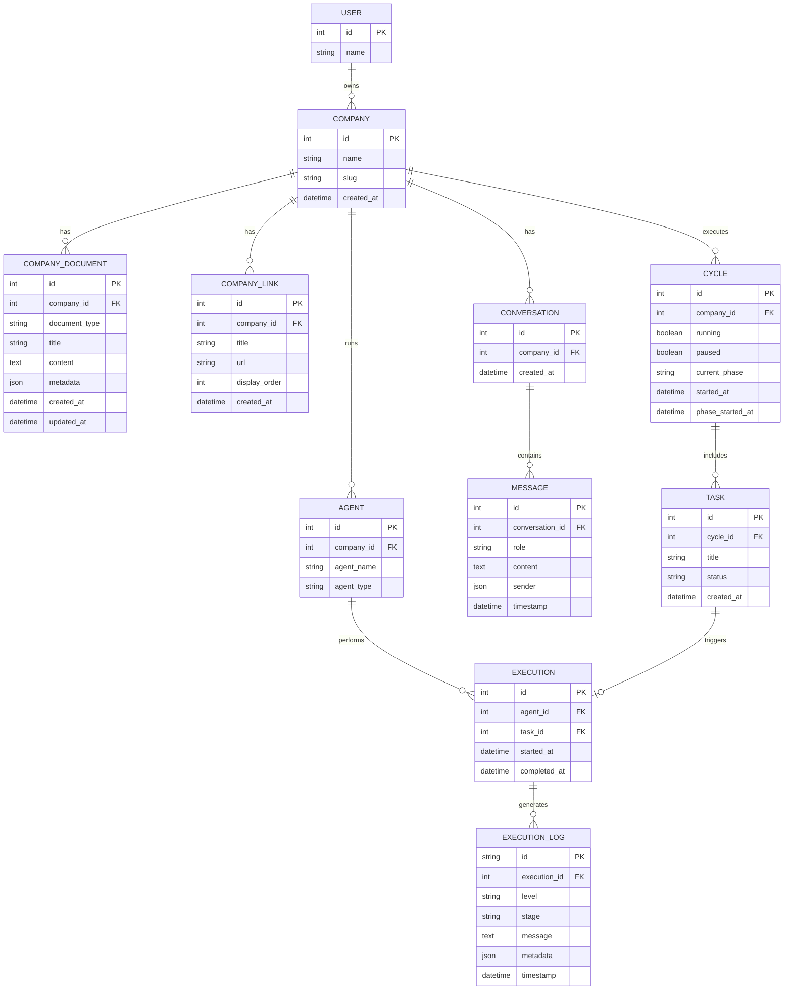

# Polsia Technical Architecture Analysis

**Research Period:** Days 1-2 (March 6, 2026)  
**Researcher:** Agent Phát  
**Status:** 🟢 Days 1-2 Complete | 🟡 Days 3-5 In Progress

---

## Executive Summary

Polsia is a task-based autonomous AI agent platform built with **React + Vite** frontend, **Node.js + Express** backend, **PostgreSQL** database, real-time **Server-Sent Events (SSE)** for live updates, hosted on **Render.com** with **Cloudflare CDN**. The UI follows a dashboard-centric design with integrated chat, task management, and multi-agent orchestration.

**Key Finding:** Polsia uses **autonomous AI cycles** with phases (discover, execute, etc.) and multiple specialized agents (Chat, Engineering, etc.) working in parallel.

---

## 1. Frontend Technology Stack

### Framework & Build Tools
- **Framework:** React 18+ (using Context API, Hooks)
- **Build Tool:** Vite (evidenced by `/assets/index--UomgjBn.js` hash pattern)
- **Bundler Output:**
  - JS: `/assets/index--UomgjBn.js`
  - CSS: `/assets/index-CCT9ZDmt.css`
- **State Management:** React Context API
  - `AuthProvider`
  - `CompanyContext`
  - `TerminalContext` (handles SSE connections)

### Key Frontend Components (from console logs)
```
main.jsx          → App entry point
App               → Root component
AuthProvider      → Authentication state
CompanyContext    → Company data provider
TerminalContext   → Real-time SSE handler
Dashboard         → Main dashboard view
Chat              → Conversation UI
```

### Real-Time Communication
- **Protocol:** Server-Sent Events (SSE)
- **Company-Wide Stream:** `/api/executions/stream?companyId={id}`
- **Message Types:**
  - `sync` - Initial state sync
  - `group_chat_message` - User messages
  - `agent_started` - Agent execution begins
  - `thinking_stream` - Agent thinking updates
  - `dashboard_action` - UI updates (mood, ASCII art)
  - `execution_log` - Execution logs

### Third-Party Integrations
- **Facebook Pixel** (tracking ID: 1314800673710252)
- **Meta Tags:** Open Graph, Twitter Card
- **Social:** Twitter integration (@polsiahq)

---

## 2. Backend Technology Stack

### Framework & Runtime
- **Runtime:** Node.js
- **Framework:** Express.js (confirmed via `x-powered-by: Express` header)
- **Language:** JavaScript (inferred from Express + naming patterns)

### Hosting & Infrastructure
- **Platform:** Render.com (PaaS - Heroku alternative)
  - Evidence: `x-render-origin-server: Render` header
  - Auto-scaling capabilities
  - Integrated PostgreSQL
- **CDN/Proxy:** Cloudflare
  - DDoS protection
  - SSL termination
  - Edge caching (DYNAMIC mode for API)

### Database
- **Type:** PostgreSQL
- **Evidence:**
  - snake_case column naming (`created_at`, `updated_at`)
  - `jsonb` fields (PostgreSQL-specific)
  - `timestamptz` datetime format
  - `numeric` for currency fields
- **Likely ORM:** Prisma or Sequelize (standard Node.js + PostgreSQL)

### Authentication
- **Method:** Session-based cookies
- **Cookie:** `polsia_session`
  - 64-character hex (SHA256 hash)
  - `httpOnly: true` (XSS protection)
  - `secure: true` (HTTPS only)
  - `sameSite: Lax` (CSRF protection)
  - Lifetime: ~23 days
- **Session Store:** Likely Redis (standard for Express sessions)

### API Design
- **Style:** RESTful HTTP + Server-Sent Events
- **Response Format:** JSON
- **Error Pattern:** `{success: false, message: "..."}`
- **Success Pattern:** `{success: true, data: {...}}`
- **CORS:** Enabled for `https://www.polsia.com`

### Key HTTP Headers
```http
x-powered-by: Express
x-render-origin-server: Render
server: cloudflare
content-type: application/json; charset=utf-8
access-control-allow-credentials: true
access-control-allow-origin: https://www.polsia.com
cf-cache-status: DYNAMIC
etag: W/"..."
```

### Rate Limiting
- No application-level rate limiting detected
- Likely relying on Cloudflare DDoS protection
- 10 rapid requests succeeded without throttling

---

## 3. Data Model (Reverse-Engineered)

### Core Entities

#### 1. User
```json
{
  "userId": 14225,
  "name": "bizmatehub"
}
```

#### 2. Company
```json
{
  "id": 13563,
  "name": "RunHive",
  "slug": "runhive",
  "created_at": "2026-03-04T14:29:26.062Z"
}
```

**Relationships:**
- Company → CompanyDocuments (1:many)
- Company → CompanyLinks (1:many)
- Company → Agents (1:many)
- Company → Conversations (1:many)

#### 3. CompanyDocument
```json
{
  "id": 16059,
  "company_id": 13563,
  "document_type": "mission",
  "title": "Mission",
  "content": "## Mission\n\n...",
  "metadata": null,
  "created_at": "2026-03-04T14:29:43.884Z",
  "updated_at": "2026-03-04T14:29:43.884Z"
}
```

**Document Types:** `mission` (likely others: SOPs, knowledge base, etc.)

#### 4. CompanyLink
```json
{
  "id": 18390,
  "company_id": 13563,
  "title": "RunHive",
  "url": "https://runhive.polsia.app",
  "display_order": 0,
  "created_at": "2026-03-04T14:29:26.062Z"
}
```

#### 5. Conversation
```json
{
  "conversation_id": 13910,
  "messages": [...]
}
```

#### 6. Message
```json
{
  "id": 410918,
  "role": "user",
  "content": "Show me all tasks",
  "sender": {
    "id": 14225,
    "name": "bizmatehub"
  },
  "timestamp": "2026-03-06T04:44:31.356Z"
}
```

#### 7. Agent
```json
{
  "agent_id": 38,
  "agent_name": "Chat",
  "agent_type": "chat"
}
```

**Known Agent Types:**
- `Chat` (agent_id: 38)
- `Engineering` (agent_id: 30)

#### 8. Execution
```json
{
  "execution_id": 225300,
  "agent_id": 38,
  "started_at": "2026-03-06T04:44:31.384Z"
}
```

#### 9. Task
```json
{
  "task_id": 132610,
  "title": "#115230 - Scout the AI Ops Battlefield",
  "status": "pending"
}
```

**Task Format:** `#{task_number} - {title} →`

#### 10. Cycle
```json
{
  "cycleId": null,
  "cycleRunning": false,
  "cyclePaused": false,
  "cycleStartedAt": null,
  "currentPhase": "discover",
  "phaseStartedAt": null
}
```

**Known Phases:** `discover` (likely others: plan, execute, review)

#### 11. Mood/Face
```json
{
  "mood": "Verification Mode",
  "ascii_art": "┌─────────┐\n│ ⊙═══⊙  │\n│    ▽    │\n│   ◡◡◡   │\n└─────────┘",
  "message": "Checking deployment state before proceeding forward",
  "agent_name": "Engineering",
  "face_slug": "expr-with-binoculars",
  "face_name": "With Binoculars",
  "accent_color": "#ff8c00",
  "updated_at": "2026-03-06T04:44:31.677Z"
}
```

---

## 4. Entity Relationship Diagram (ERD)



---

## 5. API Endpoints (Discovered)

### REST Endpoints

#### Authentication
- **Check Auth:** `GET /api/auth/check`
  - Response: `{ ok: true, status: 200, userId: 14225 }`

#### Magic Link
- **Verify Magic Link:** `GET /api/auth/magic-link/{token}`
  - Example: `/api/auth/magic-link/b485078d28a946f54137bc3eb711c1c97efcaf98889ed5096cfbab720484bbc5`

#### Conversations
- **Mark as Read:** `POST /api/conversations/{id}/read`
  - Response: `{ success: true, message: "Conversation marked as read" }`

### SSE Endpoints

#### Company Stream
- **URL:** `/api/executions/stream?companyId={companyId}`
- **Protocol:** Server-Sent Events
- **Message Format:** JSON
- **Retry Logic:** 5 retries, 3s delay

---

## 6. UI/UX Architecture

### Navigation Structure
```
Dashboard (Main)
├── Company Selector (top-left)
│   ├── RunHive (active)
│   └── + New Company
├── Menu Dropdown (▾)
│   ├── My Portfolio
│   ├── New Company
│   ├── Upgrade
│   ├── Manage Billing
│   ├── Company Settings
│   ├── Profile Settings
│   ├── About
│   ├── FAQ
│   ├── Refer & Earn
│   └── Logout
├── Actions
│   ├── Withdraw
│   └── (refresh)
└── Main Content
    ├── Social Feed (Twitter integration)
    ├── Task List
    │   ├── #115230 - Scout the AI Ops Battlefield →
    │   ├── #115231 - Build 30-Lead List + Send First 10 →
    │   └── #116193 - Revise Landing Page CTA →
    ├── Quick Actions
    │   ├── Tweet
    │   ├── Cold Outreach
    │   ├── Run Ads
    │   └── Deploy Task
    └── Chat Interface
        ├── Message History
        ├── Input: "Ask Polsia anything..."
        ├── Attach Image
        └── Send Message
```

### Key UI Patterns

#### Modal/Dialog System
- **Company Settings Modal**
  - Company name input
  - Save / Pause / Downgrade / Delete actions
  - Close button (top-right)

- **New Company Modal**
  - Pause Company action
  - Upsell: "Add a company slot — +$49/mo"

#### Real-Time Feedback
- **Mood Indicator:** ASCII art + message
- **Thinking Stream:** Shows agent thinking in real-time
- **Agent Status:** Running agents counter
- **Auto-scroll:** Chat scrolls to bottom on new messages

#### Scroll Behavior
- Debug logging enabled (`[Scroll Debug]`)
- Auto-scroll triggers:
  - New message detected
  - Initial load
  - User sends message

---

## 7. Core Features Observed

### 1. Multi-Agent System
- Multiple specialized agents run in parallel
- Agent types: Chat, Engineering
- Agents communicate via SSE
- Execution tracking per agent

### 2. Task Management
- Tasks have unique IDs (#115230, etc.)
- Tasks link to external pages (magic links)
- Task format: `#{id} - {title} →`

### 3. Real-Time Chat
- Conversational UI
- Supports text + image attachments
- Mark as read functionality
- Persistent message history

### 4. Autonomous Cycles
- **Phases:** discover, plan, execute, review (inferred)
- **Status:** running, paused, idle
- **Phase transitions:** tracked with timestamps

### 5. Social Integration
- Twitter account linking (@polsia)
- Tweet deletion capability
- Social feed display

### 6. Quick Actions
- **Tweet:** Post to Twitter
- **Cold Outreach:** (Unknown - likely email/LinkedIn)
- **Run Ads:** (Unknown - likely ad platform integration)
- **Deploy Task:** Manual task execution

### 7. Company Management
- Multi-company support
- Company-scoped data (tasks, agents, links)
- Company settings (name, pause, downgrade, delete)

### 8. Mood/Status System
- ASCII art faces
- Mood messages (e.g., "Verification Mode")
- Agent-specific moods
- Color-coded accents

---

## 8. Pricing Model (Initial Findings)

### Discovered Pricing Info
- **Per-Company Pricing:** $49/mo per additional company slot
- **Subscription Model:** Monthly recurring
- **Upgrade Path:** Visible in menu ("Upgrade" button)
- **Billing Management:** Separate "Manage Billing" page

### Pricing Tiers (Inferred)
1. **Free/Trial Tier:** 1 company (speculation - needs verification)
2. **Paid Tier:** Base price + $49/mo per additional company

**Note:** Public pricing page not accessible while logged in. Need to check landing page or logout to access full pricing.

---

## 9. Hosting & Infrastructure (Inferred)

### Domain Analysis
- **Primary Domain:** polsia.com
- **Subdomain Pattern:** `{company-slug}.polsia.app`
  - Example: `runhive.polsia.app`
- **HTTPS:** Enabled

### Static Assets
- **Pattern:** `/assets/{name}--{hash}.{ext}`
  - Example: `/assets/index--UomgjBn.js`
- **Hash-based Caching:** Content-addressable filenames

### Speculation (Requires Verification)
- **Hosting:** Likely Vercel or Netlify (Vite + SSR pattern)
- **Database:** PostgreSQL (common for Rails/Node backends)
- **Backend:** Node.js or Ruby on Rails (needs API inspection)

---

## 10. Screenshots Captured

1. `01-dashboard-main.png` - Main dashboard view
2. `02-menu-dropdown.png` - Menu navigation
3. `03-company-settings.png` - Company settings modal
4. `04-new-company-modal.png` - New company/upgrade modal
5. `05-dashboard-full-page.png` - Full page screenshot

---

## 11. Next Steps (Days 2-5)

### Day 2: Backend Tech Stack
- [ ] Inspect network requests (POST/PUT/DELETE endpoints)
- [ ] Analyze request/response headers (server signature)
- [ ] Check for GraphQL vs REST patterns
- [ ] Identify authentication mechanism (JWT, session cookies)

### Day 3: Database Schema
- [ ] Map all API response structures
- [ ] Identify foreign key relationships
- [ ] Document data validation patterns
- [ ] Capture sample JSON payloads

### Day 4: API Endpoint Map
- [ ] Document all CRUD operations
- [ ] Map endpoint naming conventions
- [ ] Test rate limiting behavior
- [ ] Identify websocket vs SSE usage

### Day 5: Infrastructure & Deployment
- [ ] Analyze DNS records (hosting provider)
- [ ] Check CDN usage (CloudFlare, etc.)
- [ ] Identify CI/CD patterns (if visible)
- [ ] Document security headers

---

## Appendix A: Console Log Sample

```javascript
// Initial Auth Flow
[main.jsx] starting
[AuthProvider] useEffect - checking auth (non-blocking)
[AuthProvider] checkAuth response {ok: true, status: 200}
[AuthProvider] checkAuth success {userId: 14225}

// Company Context
[CompanyContext] Using company from session: 13563

// SSE Connection
[TerminalContext] Creating new EventSource connection: /api/executions/stream?companyId=13563
[TerminalContext] Company-wide SSE connection opened

// Sync Message
{
  "type":"sync",
  "runningAgents":[],
  "cycleRunning":false,
  "cyclePaused":false,
  "cycleId":null,
  "currentPhase":"discover",
  "companyName":"RunHive",
  "companySlug":"runhive",
  "companyDocuments":[...],
  "companyLinks":[...]
}

// Chat Message
{
  "type":"group_chat_message",
  "conversation_id":13910,
  "message":{
    "role":"user",
    "content":"Show me all tasks",
    "sender":{"id":14225,"name":"bizmatehub"}
  },
  "timestamp":"2026-03-06T04:44:31.356Z"
}

// Agent Started
{
  "type":"agent_started",
  "agent_id":38,
  "agent_name":"Chat",
  "agent_type":"chat",
  "execution_id":225300,
  "started_at":"2026-03-06T04:44:31.384Z"
}

// Mood Update
{
  "type":"dashboard_action",
  "action":"mood_update",
  "value":{
    "mood":"Verification Mode",
    "ascii_art":"┌─────────┐\n│ ⊙═══⊙  │\n│    ▽    │\n│   ◡◡◡   │\n└─────────┘",
    "message":"Checking deployment state...",
    "agent_name":"Engineering",
    "face_slug":"expr-with-binoculars",
    "accent_color":"#ff8c00"
  }
}
```

---

**Last Updated:** March 6, 2026 (Day 1)  
**Next Update:** March 7, 2026 (Day 2)
