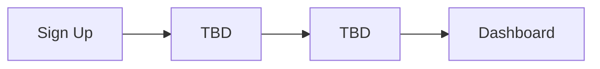

# Polsia - UX/UI Patterns Analysis

**Research Status:** 🔴 Blocked (pending access)  
**Researcher:** Agent Phát  
**Last Updated:** 2026-03-06  

---

## Executive Summary

> UX/UI analysis pending dashboard access

---

## 1. Design System Analysis

### Visual Design

#### Color Palette
- **Primary:** TBD
- **Secondary:** TBD
- **Accent:** TBD
- **Neutrals:** TBD
- **Semantic Colors:** 
  - Success: TBD
  - Warning: TBD
  - Error: TBD
  - Info: TBD

#### Typography
- **Font Family:** TBD
- **Headings:** TBD
- **Body Text:** TBD
- **Code/Monospace:** TBD
- **Scale:** TBD (h1-h6 sizes)

#### Spacing System
- **Base Unit:** TBD (likely 4px or 8px)
- **Scale:** TBD (4, 8, 12, 16, 24, 32, 48, 64...)

#### Grid System
- **Columns:** TBD (likely 12-column)
- **Breakpoints:** TBD
  - Mobile: TBD
  - Tablet: TBD
  - Desktop: TBD
  - Wide: TBD

---

## 2. Navigation Structure

### Information Architecture

```
Dashboard (assumed structure)
├── Overview / Home
├── Leads / Contacts
├── Campaigns
├── Automation
├── Analytics
├── Settings
└── Help / Support
```

**To be verified and detailed after access**

### Navigation Patterns
- **Primary Navigation:** TBD (sidebar, top nav, hybrid?)
- **Secondary Navigation:** TBD
- **Breadcrumbs:** TBD (used/not used)
- **Search:** TBD (global search available?)

---

## 3. UI Component Library

### Core Components

**Note:** Requires screenshot capture and inspection

Expected components:
- [ ] Buttons (primary, secondary, tertiary, ghost, danger)
- [ ] Form inputs (text, select, checkbox, radio, date)
- [ ] Data tables (sorting, filtering, pagination)
- [ ] Cards
- [ ] Modals/Dialogs
- [ ] Dropdowns/Menus
- [ ] Tabs
- [ ] Accordions
- [ ] Toasts/Notifications
- [ ] Loading states (spinners, skeletons)
- [ ] Empty states
- [ ] Error states
- [ ] Badges/Tags
- [ ] Avatars
- [ ] Charts/Graphs
- [ ] Progress indicators

### Interaction Patterns
- **Hover States:** TBD
- **Active States:** TBD
- **Disabled States:** TBD
- **Focus Indicators:** TBD
- **Animations:** TBD (timing, easing)

---

## 4. Key User Flows

### Onboarding Flow



**Steps to Document:**
1. Initial signup form
2. Email verification
3. Account setup
4. Workspace configuration
5. First-time user experience (FTUE)
6. Activation milestones

### Lead Management Flow

**To be mapped after dashboard access**

### Campaign Creation Flow

**To be mapped after dashboard access**

### Automation Setup Flow

**To be mapped after dashboard access**

---

## 5. Responsive Design

### Mobile Experience
- **Approach:** TBD (responsive, adaptive, mobile-first?)
- **Breakpoints:** TBD
- **Mobile Navigation:** TBD (hamburger menu, bottom nav?)
- **Touch Targets:** TBD (size, spacing)
- **Mobile-Specific Features:** TBD

### Cross-Device Consistency
- **Desktop:** TBD
- **Tablet:** TBD
- **Mobile:** TBD

---

## 6. Accessibility Features

### WCAG Compliance
- **Level:** TBD (A, AA, AAA target?)
- **Keyboard Navigation:** TBD
- **Screen Reader Support:** TBD
- **Color Contrast:** TBD
- **Focus Management:** TBD
- **ARIA Labels:** TBD

### Accessibility Tools Used
- To be detected via code inspection

---

## 7. Micro-interactions & Animations

### Animation Principles
- **Loading States:** TBD
- **Transitions:** TBD
- **Feedback Animations:** TBD
- **Skeleton Screens:** TBD (used/not used)
- **Optimistic UI:** TBD (immediate feedback before server confirmation)

### Delight Moments
- TBD (easter eggs, celebrations, gamification)

---

## 8. Data Visualization

### Chart Types Used
- [ ] Line charts
- [ ] Bar charts
- [ ] Pie/Donut charts
- [ ] Area charts
- [ ] Funnel charts
- [ ] Heat maps
- [ ] Tables with inline charts

### Visualization Library
- **Library:** TBD (Chart.js, D3, Recharts, Nivo, etc.)
- **Interactivity:** TBD (tooltips, drill-down, filtering)

---

## 9. Performance & UX

### Loading Patterns
- **Initial Load:** TBD
- **Route Transitions:** TBD
- **Data Fetching:** TBD (loading spinners, skeleton screens)
- **Lazy Loading:** TBD (images, routes, components)

### Error Handling UX
- **Network Errors:** TBD
- **Validation Errors:** TBD
- **Permission Errors:** TBD
- **Empty States:** TBD

---

## 10. Design Trends & Best Practices

### Modern UX Patterns Observed
- TBD (to be evaluated against industry standards)

### Areas of Excellence
- TBD (what Polsia does exceptionally well)

### UX Pain Points
- TBD (friction, confusion, inefficiencies)

---

## 11. Screenshot Inventory

**To be captured:**

### Dashboard Views
- [ ] Main dashboard / overview
- [ ] Lead list view
- [ ] Lead detail view
- [ ] Campaign list
- [ ] Campaign builder
- [ ] Automation workflow builder
- [ ] Analytics / reports
- [ ] Settings pages
- [ ] User profile

### Component Library
- [ ] Button variants
- [ ] Form elements
- [ ] Data table examples
- [ ] Modal examples
- [ ] Notification examples

### User Flows
- [ ] Onboarding screens
- [ ] Create lead flow
- [ ] Create campaign flow
- [ ] Setup automation flow

**Storage:** `research/screenshots/`

---

## 12. Comparative UX Analysis

### How Polsia Compares to Competitors

| Aspect | Polsia | HubSpot | Pipedrive | ActiveCampaign |
|--------|--------|---------|-----------|----------------|
| Visual Design | TBD | Modern, colorful | Clean, minimal | Dated, cluttered |
| Navigation | TBD | Complex | Simple | Moderate |
| Onboarding | TBD | Comprehensive | Quick | Mixed |
| Mobile UX | TBD | Good | Excellent | Poor |
| Data Viz | TBD | Excellent | Basic | Good |

---

## 13. BizMate UX Opportunities

(To be completed after full analysis)

### What to Copy
1. TBD (best practices worth emulating)

### What to Improve
1. TBD (areas where we can do better)

### Unique UX Differentiators
1. TBD (how BizMate can stand out)

---

## Research Blockers

### Critical Gaps
1. **No Dashboard Access**
   - Cannot view UI components
   - Cannot capture screenshots
   - Cannot test user flows

2. **No Onboarding Flow**
   - Cannot experience FTUE (First Time User Experience)
   - Cannot document activation journey

### Required Tools (Currently Unavailable)
- Browser with DevTools (for CSS inspection)
- Screenshot capability
- Screen recording (for flow documentation)
- Color picker tool
- Accessibility audit tool

### Next Steps (Once Unblocked)
1. **Day 1:** Systematic screenshot capture (all major screens)
2. **Day 2:** Component library documentation
3. **Day 3:** User flow mapping (onboarding, core tasks)
4. **Day 4:** Design system extraction (colors, typography, spacing)
5. **Day 5:** Competitive UX comparison
6. **Day 6:** Accessibility audit
7. **Day 7:** Synthesis & recommendations

**Estimated Time:** 7-10 hours with full access

---

## Design System Extraction Checklist

When access is obtained:

**Visual Assets**
- [ ] Export color palette (hex codes)
- [ ] Document font stack
- [ ] Measure spacing units
- [ ] Capture iconography
- [ ] Screenshot component states

**Layout**
- [ ] Grid system analysis
- [ ] Breakpoint detection
- [ ] Container max-widths
- [ ] Gutter sizes

**Interactions**
- [ ] Hover/focus states
- [ ] Transition timings
- [ ] Animation easing functions
- [ ] Loading states

**Code Inspection**
- [ ] CSS framework detection (Tailwind, Bootstrap, custom?)
- [ ] Component library (Material-UI, Ant Design, custom?)
- [ ] Icon library (FontAwesome, Feather, custom?)
